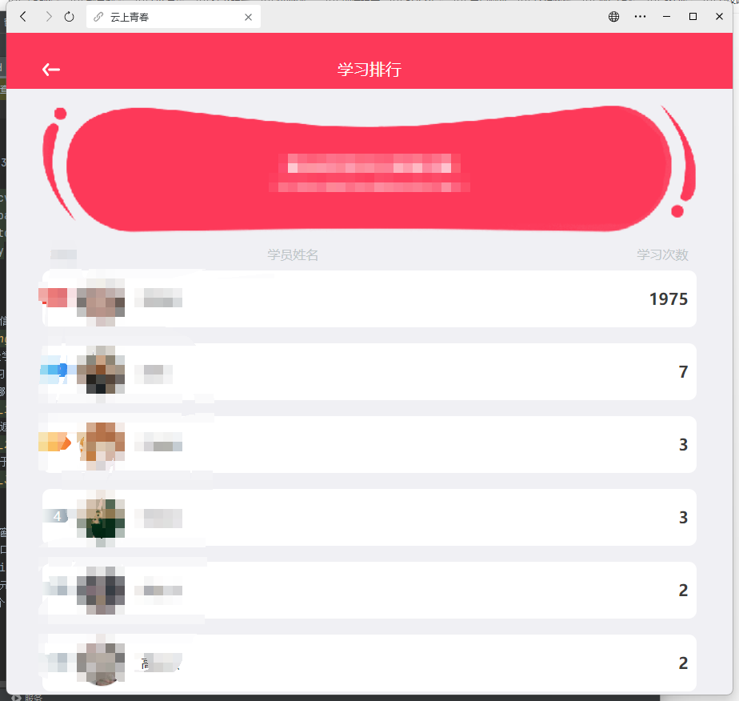
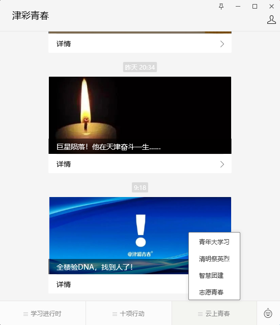
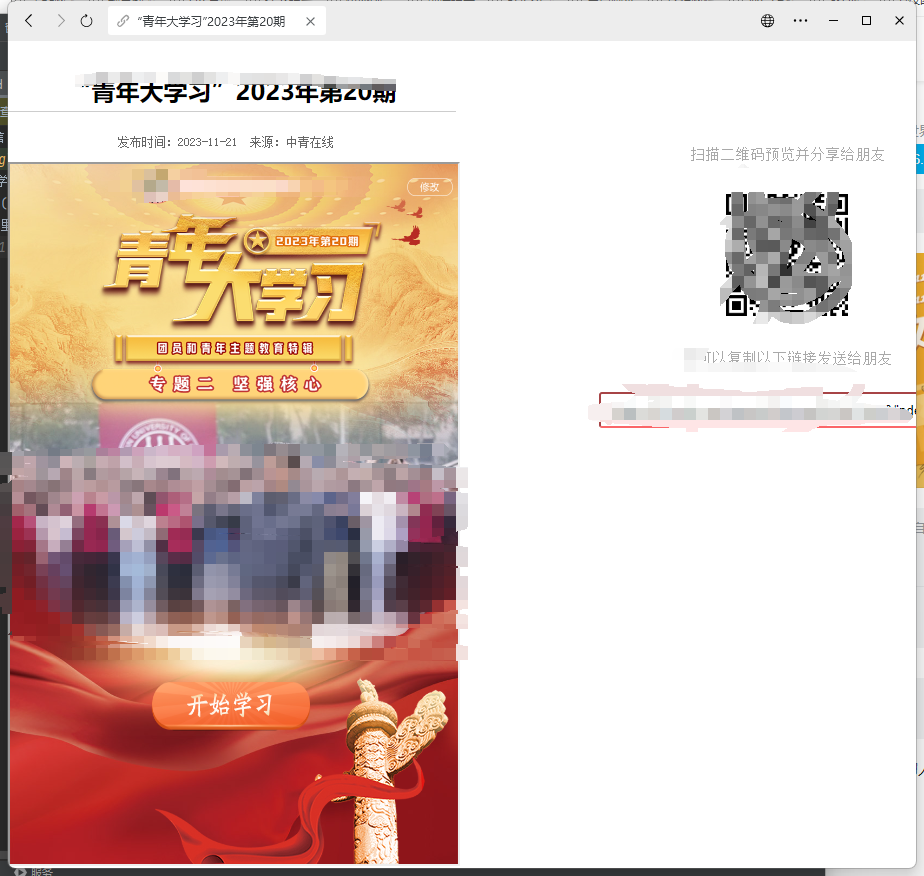
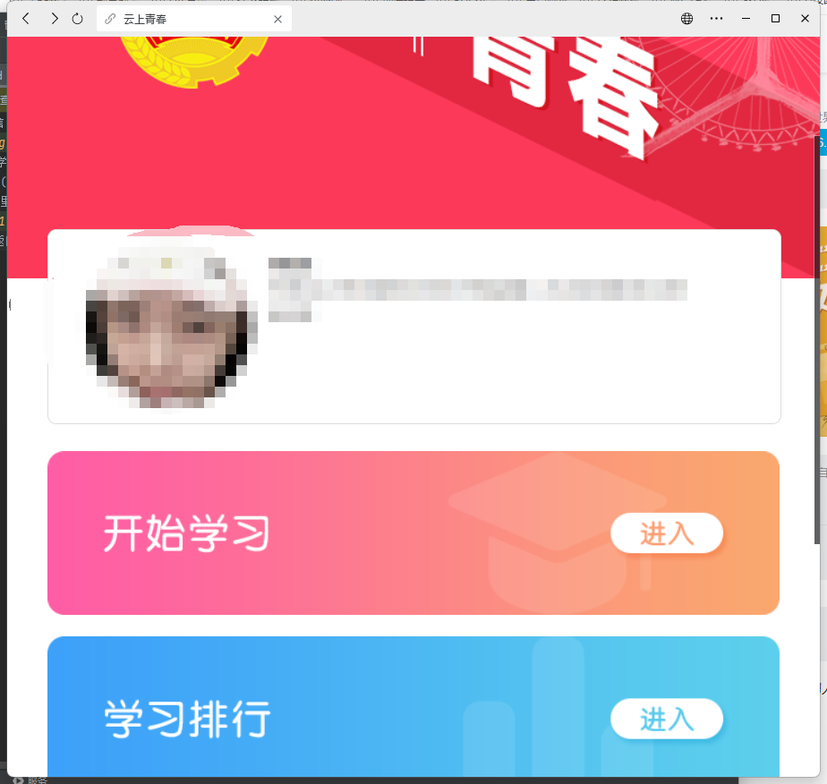

## 这是刷次数不是全自动青年大学习


## 快速开始

### 开发环境
- Python 3.9 或更高版本

```shell
pip install opencv-python
pip install keyboard
pip install pyautogui
pip install numpy
```

### 前期工作

1. 首先打开你的电脑版微信，搜索“津彩青春”，点击进入公众号。
   

2. 点击 "云上青春-青年大学习"。

3. 依次点击 "开始学习(进入)" -> "开始学习(进入)"，进入视频界面。

4. 在视频界面中，填写你的位置（也就是你所在的团员位置），直到视频可以正常出现播放按钮。
   

5. 点击左上角的返回按钮，进入到这个页面。
   

6. 确保这一块位于窗口内完整显示。
   

7. 接下来，请确保没有其他窗口遮挡住这个小程序窗口。程序会自动获取这个窗口并将其放置在1080p的屏幕中间位置。因此，请确保其他窗口，包括IDE，最好不要位于屏幕中心，以免影响识别。

8. 保证页面中没有相似的元素影响识别，比如浏览器的返回按钮。

9. 运行程序，它将自动进行刷次数。如果出现问题，可以查看控制台输出。

ps:这是一个玩个乐呵的程序 晚上自己挂一晚上玩玩就行
如果你可以完善这个程序，欢迎提交PR。
比如打包成exe，加入按键监听,或者适配更多地区的青年大学习等等。